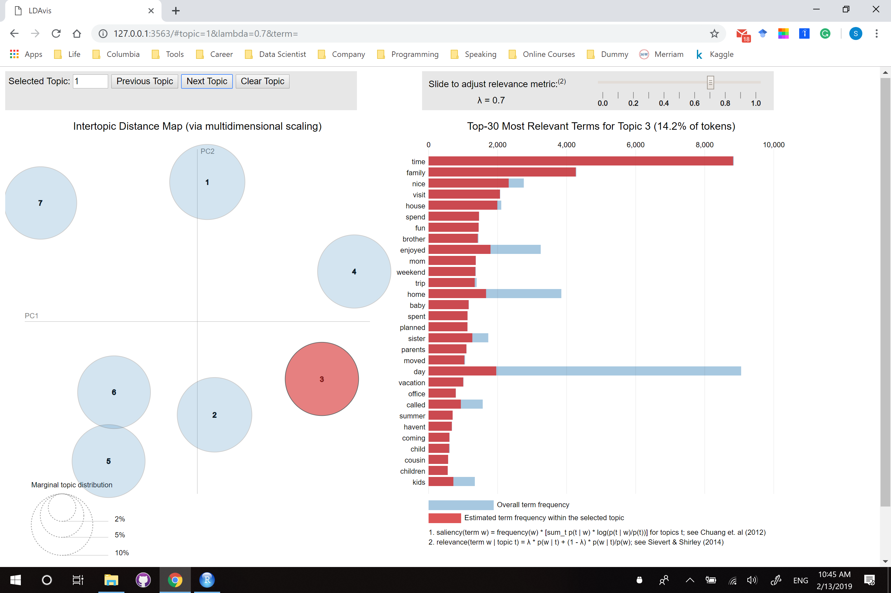

```{r setup, include=FALSE}
knitr::opts_chunk$set(echo = TRUE)
```

## Preparation

#### Step 0 - Load all the required Libraries

I will not use word cloud in this report as to some extend, I think word cloud is misleading and can not give more insight than other plot like bar-plot or box-plot.

```{r load libraries, warning=FALSE, message=FALSE}
library(tidytext)
library(tidyverse)
library(tidyr)
library(tm)

library(topicmodels)
library(LDAvis)
library(slam)
library(servr)
library(gridExtra)
library(ggridges)
```

#### Step 1 - Load the cleaned and processed data

Considering the conciseness, all of the text preprocessing part are done in `Text_Processing_Modified.rmd` and the data we use here is called `processed_moments_modified.csv` saved in `output`. 

```{r read data, warning=FALSE, message=FALSE}
hm_tbl <- read.csv("../output/processed_moments_modified.csv", stringsAsFactors=FALSE) %>% as.tibble()
hm_tbl_re <- hm_tbl %>% mutate(age = ifelse(age >= 75, 75, age))

dtm <- hm_tbl_re$text %>% VectorSource() %>% VCorpus() %>% DocumentTermMatrix()
```

## Happiness V.S. Age

- Motivation: Happiness is a kind of emotion of people while the age is a character that changes with the time goes by. With the increasing of age, the knowledge, status and personality will change dynamically. 
- Goal: The main goal of this part is to analysis, how the pattern of happiness changes with the increasing of age.

### Question 1 - Demographic Information v.s. Age
```{r Create the demographic tibble, warning=FALSE, message=FALSE}
dem_tbl <- hm_tbl %>% count(age, gender, marital, parenthood)
dem_tbl_re <- dem_tbl %>% mutate(age = ifelse(age >= 75, 75, age))
```

#### Step 1 - Let's see the distribution of gender
```{r, warning=FALSE, message=FALSE}
dem_tbl %>% 
  group_by(age, gender) %>% 
  summarise(percent = sum(n)) %>% 
  mutate(percent = percent/sum(percent)) %>%
  ggplot(aes(x = age, y = percent, fill = gender)) + 
  geom_col(position = "stack", width=0.8)
```

We can see that:
- The percentage of gender is fluctuating with the increasing of age
- After 80, most of the interviewees are female. 

#### Step 2 - Group all interviewees after 75
```{r, warning=FALSE, message=FALSE}
dem_tbl_re %>% 
  group_by(age, gender) %>% 
  summarise(percent = sum(n)) %>% 
  mutate(percent = percent/sum(percent)) %>%
  ggplot(aes(x = age, y = percent, fill = gender)) + 
  geom_col(position = "stack", width=0.87)
```

#### Step 3 - Exam the `marital` status 

```{r, warning=FALSE, message=FALSE}
dem_tbl_re %>% 
  group_by(age, marital) %>% 
  summarise(percent = sum(n)) %>% 
  mutate(percent = percent/sum(percent)) %>%
  ggplot(aes(x = age, y = percent, fill = marital)) + 
  geom_col(position = "stack", width=0.8)
```

#### Step 4 - Exam the `parenthood` status 

```{r, warning=FALSE, message=FALSE}
dem_tbl_re %>% 
  group_by(age, parenthood) %>% 
  summarise(percent = sum(n)) %>% 
  mutate(percent = percent/sum(percent)) %>%
  ggplot(aes(x = age, y = percent, fill = parenthood)) + 
  geom_col(position = "stack", width=0.87)
```

We can see clearly with the increasing of age, things like `parenthood` and `marital` changes dramatically. 

What we are interested is that are these demographic information affect the happiness. If yes, how it affects happiness specially and if not, why?

### Question 2 - Single Value Index v.s. Age

- Motivation: The survey is mainly about what makes people happy but we may also be interested in the level of happiness. Traditionally, we have several different ways to quantify the happiness but here we choose the most simple one: score the sentence by summing the scores of the each words. 
- Goal: Figure out a single value index to score each "happy moment" to measure the intensity of happiness.

#### Step 1 - Score the sentence

```{r, warning=FALSE, message=FALSE}
hm_token <- hm_tbl_re %>%
  unnest_tokens(word, text) %>%
  inner_join(get_sentiments("afinn"), by="word") %>%
  mutate(score = abs(score))
```

We use "afinn" here and we reverse all the negative score because this is the corpus of happy thing, almost all of the negative words will be negate at last. 

#### Step 2 - Visualization of score against age.

```{r, warning=FALSE, message=FALSE}
hm_token %>%
  mutate(score = abs(score), age = plyr::round_any(age+5, 10)) %>%
  group_by(age) %>%
  mutate(mean = mean(score)) %>%
  ggplot() + 
  geom_jitter(aes(x = factor(age), y = score), alpha = 0.06) + 
  geom_point(aes(x = factor(age), y = mean), color="red", shape="*", size = 7) +
  labs(x = "Range of Age", 
       y = "Scatter of scores")

hm_token %>%
  mutate(score = abs(score), age = plyr::round_any(age, 10)) %>%
  ggplot(aes(x = score, y = factor(age))) + 
  geom_density_ridges(aes(x = score, y = factor(age))) + 
  labs(x = "Density of scores", 
       y = "Range of Age")
```

- The red points on scatter plot is the mean of score of happy moments in that range of age say, 20-30 for example.
- From the ridges plot, we can see the distribution of the score is almost the same!

Here, the conclusion is no interesting. We found that the intensity of happiness is almost the same. 

### Question 3 - Topic Modelling v.s. age

- Motivation: We have see that with the increasing of age, the demographics information changes dramatically while the intensity of happiness remains all most the same. So, what's really changes? Could it be the content/object of happiness changes?
- Goal: Figure out whether what makes people happy changes with the increasing of age. 

#### Step 1 - Use `predicted_category` as topics

```{r, warning=FALSE, message=FALSE}
hm_tbl_re %>% 
  count(age, predicted_category) %>% 
  group_by(age, predicted_category) %>%
  summarise(percent = sum(n)) %>% 
  mutate(percent = percent/sum(percent)) %>%
  ggplot(aes(x = age, y = percent, color = predicted_category)) + 
  geom_line(size = 1, 
            alpha = 0.6) +
  geom_vline(xintercept = 64, 
             size = 1, 
             alpha = 0.6, 
             color = "red")
```

Above shows the percentage of different categories against age.

- Generally, we will focus on age between 20 to 60 as out of this range, the sample size is not that large. 
- Two categories, `achievement` and `affection` are dominate 5 of others. It shows that family and achievement are generally most important things during the whole life of a person.
- With the increasing of age, the most obvious two things is that people care more about `affection` and less about `achievement`.

#### Step 2 - Make our own topics

We can see from above, `achievement` and `affection` are dominate others. So, if possible, can we 

##### Part 1 - Build the LDA model
```{r, warning=FALSE, message=FALSE}
burnin <- 500
iter <- 1000
keep <- 30

k <- 7

mods <- LDA(dtm, k, 
            method = "Gibbs",
            control = list(burnin = burnin,
                           iter = iter,
                           keep = keep))


```

##### Part 2 - Visualize the LDA model

ATTENTION: THIS IS AN INTERACTIVE JSON FILE AND SHOWN BEST WITH BROSWER. IT LOOKS LIKE:



THIS IS VERY INTERESING, PLEASE DO RUN THE FOLLOWING CODES IN THE .RMD FILE AND PLAY WITH. I JUST DOWN KNOW HOW TO KNIT IT INTO HTML
```{r}
# Find required quantities
phi <- as.matrix(posterior(mods)$terms)
theta <- as.matrix(posterior(mods)$topics)
vocab <- colnames(phi)
term_freq <- col_sums(dtm)

# Convert to json
json_lda <- createJSON(phi = phi, 
                       theta = theta,
                       vocab = vocab,
                       doc.length = as.vector(table(dtm$i)),
                       term.frequency = term_freq)

serVis(json_lda)
```

##### Part 3 - Extract the topics

```{r}
topics <- as.matrix(topics(mods))
terms <- as.matrix(terms(mods,10))
terms %>% as_tibble()
```

Here are the new topics. We can see that it seems `affection` are separated into Topic 1 and Topic 7 where Topics focus more on the single members within the family where Topic 7 treat family more as a abstract/whole concept. 

```{r}
hm_tbl_re %>% 
  mutate(topics = topics) %>% 
  count(age, topics) %>% 
  group_by(age, topics) %>%
  summarise(percent = sum(n)) %>% 
  mutate(percent = percent/sum(percent)) %>%
  ggplot(aes(x = age, y = percent, color = factor(topics))) + 
  geom_line(size = 1, 
            alpha = 0.6) +
  geom_vline(xintercept = 64, 
             size = 1, 
             alpha = 0.6, 
             color = "red")
```

Now, the percentage of topics are closer to each other. 


##### Part 4 - Try More topics

As the number of topics is an hyper-parameter, we can try several different values.

```{r, warning=FALSE, message=FALSE}
burnin <- 500
iter <- 1000
keep <- 30

k <- 10

mods <- LDA(dtm, k, 
            method = "Gibbs",
            control = list(burnin = burnin,
                           iter = iter,
                           keep = keep))


```


```{r}
topics <- as.matrix(topics(mods))
terms <- as.matrix(terms(mods,10))
terms %>% as_tibble()
```


```{r}
hm_tbl_re %>% 
  mutate(topics = topics) %>% 
  count(age, topics) %>% 
  group_by(age, topics) %>%
  summarise(percent = sum(n)) %>% 
  mutate(percent = percent/sum(percent)) %>%
  ggplot(aes(x = age, y = percent, color = factor(topics))) + 
  geom_line(size = 1, 
            alpha = 0.6) +
  geom_vline(xintercept = 64, 
             size = 1, 
             alpha = 0.6, 
             color = "red")
```